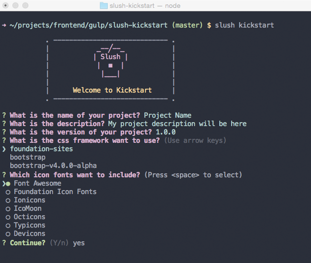

# Slush Kickstart [](https://travis-ci.org/mohamdio/slush-kickstart) [](https://www.npmjs.com/package/slush-kickstart) [](https://www.npmjs.com/package/slush-kickstart)
A slush generator to scaffold front-end projects using [Gulp Workflow](https://github.com/mohamdio/gulp-workflow).
- [Features](https://github.com/mohamdio/slush-kickstart#features)
- [Getting Started](https://github.com/mohamdio/slush-kickstart#getting-started)
- [Available Tasks](https://github.com/mohamdio/slush-kickstart#available-tasks)
- [Gulp Tasks Structure](https://github.com/mohamdio/slush-kickstart#gulp-tasks-structure)
- [Folders Structure](https://github.com/mohamdio/slush-kickstart#folders-structure)
- [Configuration & Paths](https://github.com/mohamdio/slush-kickstart#configuration--paths)



## Features
####Kickstart Features:
- Include foundation-sites framework
- Include bootstrap framework
- Include bootstrap v4.0.0-alpha (include sass)
- Include bulma framework
- Include most of icon fonts libraries (fontAwesome, ionicons, typicons ..)
- Include jQuery library
- Include all gulp workflow features below

####Gulp Workflow Features:
- Organized & splitting tasks files
- Using gulp-load-plugins
- Define tasks options & paths from one file
- Using bower to get dependencies
- Preview server with BrowserSync
- Cleans up file directories
- Plumber to handle gulp exceptions
- Sourcemaps for sass & js
- Sass compile with docs
- Js browserify & uglify
- Nunjucks templates
- Automagically inject css/js files
- Prettify html files
- Image optimization
- Generate favicons
- Concat css/js files
- & more, take a look at the gulp plugins used in [package.json](https://github.com/mohamdio/slush-kickstart/blob/master/templates/package.json)

## Getting Started
- Install [Node.js](https://nodejs.org/)
- Install [Gulp](http://gulpjs.com/) & [Slush](http://slushjs.github.io/) & [bower](http://bower.io/) globally
```
npm install -g gulp slush bower
```
- Install `slush-kickstart` globally
```
npm install -g slush-kickstart
```
- In terminal/command line, `cd` into your project directory
- Run the generator to scaffold your project
```
slush kickstart
```
- OR run the generator with `--skip-install` to skips the automatic execution of bower and npm after scaffolding has finished like that
```
slush kickstart --skip-install
```
- After all done installing and scaffolding has finished, you can run gulp tasks:
    * `gulp` to run default tasks for development
    * `gulp build` to build your project for production
    * `gulp help` to get a listing of available tasks

## Available Tasks
Task Name | Subtasks | Description
--- | --- | ---
`clean` | `clean:cache` - `clean:prod` | clean dest folders (dev & prod) & caches :: [base/clean.js](https://github.com/mohamdio/slush-kickstart/blob/master/templates/gulp/tasks/base/clean.js)
`bower` | `bower:clean` - `bower:scss` - `bower:js` - `bower:css` - `bower:fonts` | dest all bower dependencies to source folder :: [base/bower.js](https://github.com/mohamdio/slush-kickstart/blob/master/templates/gulp/tasks/base/bower.js)
`fonts` | --- | copy all fonts to dev folder :: [default/fonts.js](https://github.com/mohamdio/slush-kickstart/blob/master/templates/gulp/tasks/default/fonts.js)
`sass` | `sass:compile` - `sass:doc` - `sass:cssRebaseUrl` | compile sass files with docs & rebase css url :: [default/sass.js](https://github.com/mohamdio/slush-kickstart/blob/master/templates/gulp/tasks/default/sass.js)
`js` | `js:browserify` - `js:copySrc` | browserify & uglify js files & copy source js files to dev folder :: [default/scripts.js](https://github.com/mohamdio/slush-kickstart/blob/master/templates/gulp/tasks/default/scripts.js)
`images` | `images:minify` - `images:favicons` | minify images & generate favicons :: [default/images.js](https://github.com/mohamdio/slush-kickstart/blob/master/templates/gulp/tasks/default/images.js)
`nunjucks` | `nunjucks:render` - `nunjucks:inject` | render nunjucks files & inject css/js files :: [default/nunjucks.js](https://github.com/mohamdio/slush-kickstart/blob/master/templates/gulp/tasks/default/nunjucks.js)
`serve` | `serve:prod` | start server & open browser for dev or prod mode :: [base/serve.js](https://github.com/mohamdio/slush-kickstart/blob/master/templates/gulp/tasks/base/serve.js)
`watch` | --- | start gulp watch for tasks (bower - sass - nunjucks - js) :: [base/watch.js](https://github.com/mohamdio/slush-kickstart/blob/master/templates/gulp/tasks/base/watch.js)
`build` | --- | main build task for prod mode
--- | `build:fonts` | copy fonts to prod folder :: [build/fonts.js](https://github.com/mohamdio/slush-kickstart/blob/master/templates/gulp/tasks/build/fonts.js)
--- | `build:css` | rebase url/remove unused selectors/strip comments/beautify/concat/minify :: [build/css.js](https://github.com/mohamdio/slush-kickstart/blob/master/templates/gulp/tasks/build/css.js)
--- | `build:js` | copy js files to prod folder :: [build/scripts.js](https://github.com/mohamdio/slush-kickstart/blob/master/templates/gulp/tasks/build/scripts.js)
--- | `build:images` | copy images to prod folder :: [build/images.js](https://github.com/mohamdio/slush-kickstart/blob/master/templates/gulp/tasks/build/images.js)
--- | `build:html` | copy & prettify html files and inject minified css/js files :: [build/html.js](https://github.com/mohamdio/slush-kickstart/blob/master/templates/gulp/tasks/build/html.js)

##Gulp Tasks Structure
This is gulp folder structure:
- `config.js` file : to define tasks options
- `paths.js` file : to define all paths for tasks
- `base` folder : contain base tasks
- `default` folder : contain common tasks for development
- `build` folder : contain build tasks for production

```
gulp
├── config.js
├── paths.js
└── tasks
    ├── base
    │   ├── bower.js
    │   ├── clean.js
    │   ├── serve.js
    │   └── watch.js
    ├── build
    │   ├── css.js
    │   ├── fonts.js
    │   ├── html.js
    │   ├── images.js
    │   └── scripts.js
    └── default
        ├── fonts.js
        ├── images.js
        ├── nunjucks.js
        ├── sass.js
        └── scripts.js
```

##Folders Structure
- `source` folder : contain all source files
- `build` folder : contain dest folders `dev` for development & `prod` for production
- `bower_components` folder : contain all bower dependencies
- `gulp` folder : contain all gulp tasks files
- `node_modules` folder : contain all gulp dependencies
- `bower.json` file : define bower dependencies
- `gulpfile.js` file : define gulp tasks for default & build
- `package.json` file : define gulp dependencies

```
slush-kickstart
├── bower_components
│   ├── # bower dependencies
├── gulp
│   ├── # gulp tasks
├── node_modules
│   ├── # Gulp dependencies
├── build
│   ├── dev
│   │   ├── assets
│   │   │   ├── css
│   │   │   │   ├── _maps
│   │   │   │   ├── _sassdoc
│   │   │   │   ├── base
│   │   │   │   ├── vendor
│   │   │   │   └── main.css
│   │   │   ├── fonts
│   │   │   │   ├── # all fonts
│   │   │   ├── images
│   │   │   │   ├── favicons
│   │   │   │   └── logo.png
│   │   │   └── js
│   │   │       ├── src
│   │   │       ├── scripts.js
│   │   │       └── scripts.js.map
│   │   └── index.html
│   └── prod
│       ├── assets
│       │   ├── css
│       │   │   ├── maps
│       │   │   ├── style.css
│       │   │   └── style.min.css
│       │   ├── fonts
│       │   │   ├── # all fonts
│       │   ├── images
│       │   │   ├── favicons
│       │   │   └── logo.png
│       │   └── js
│       │       ├── scripts.js
│       │       └── scripts.js.map
│       └── index.html
├── source
│   ├── fonts
│   │   └── vendor
│   │   │   └── # icon fonts
│   │   ├── # main fonts
│   ├── images
│   │   └── logo.png
│   ├── js
│   │   ├── modules
│   │   │   └── module.js
│   │   ├── vendor
│   │   │   ├── # all vendors
│   │   └── main.js
│   ├── scss
│   │   ├── base
│   │   │   └── base.scss
│   │   ├── vendor
│   │   │   ├── lib
│   │   │   └── vendor.scss
│   │   └── main.scss
│   └── templates
│       ├── includes
│       │   └── foundation.nunjucks
│       │   └── bootstrap.nunjucks
│       │   └── bulma.nunjucks
│       ├── layouts
│       │   └── default.nunjucks
│       ├── macros
│       └── index.nunjucks
├── LICENSE
├── README.md
├── bower.json
├── gulpfile.js
└── package.json
```

##Configuration & Paths
- From [`gulp/config.js`](https://github.com/mohamdio/slush-kickstart/blob/master/templates/gulp/config.js) you can define tasks & plugins options without change anything in task file, example :
```javascript
// bower task mainBowerFiles options
    mainBowerFiles: {
        // main options
        options: {
            base: 'bower_components'
        },
        // bower:css rename options
        rename: {
            suffix: "-css",
            extname: '.scss'
        },
        // watch src
        watch: ['./bower_components/**', './bower.json']
    },
```

- From [`gulp/paths.js`](https://github.com/mohamdio/slush-kickstart/blob/master/templates/gulp/paths.js) you can define all paths for tasks, example :
```javascript
// base paths
var src    = './source/',
    dist   = './build/',
    dev    = 'dev/',
    prod   = 'prod/',
    assets = 'assets/';

// nunjucks files
        nunjucks: {
            config: src + 'templates/',
            src: src + 'templates/*.{html,nunjucks}',
            watch: src + 'templates/**/*.+(html|nunjucks)'
        },
```

## Getting To Know Slush

Slush is a tool that uses Gulp for project scaffolding.

Slush does not contain anything "out of the box", except the ability to locate installed slush generators and to run them with liftoff.

To find out more about Slush, check out the [documentation](https://github.com/slushjs/slush).

## Contributing

See the [CONTRIBUTING Guidelines](https://github.com/mohamdio/slush-kickstart/blob/master/CONTRIBUTING.md)

## Support
If you have any problem or suggestion please open an issue [here](https://github.com/mohamdio/slush-kickstart/issues).

## License
The code is available under the [MIT License](https://github.com/mohamdio/slush-kickstart/blob/master/LICENSE).

[](https://bitdeli.com/free "Bitdeli Badge")

